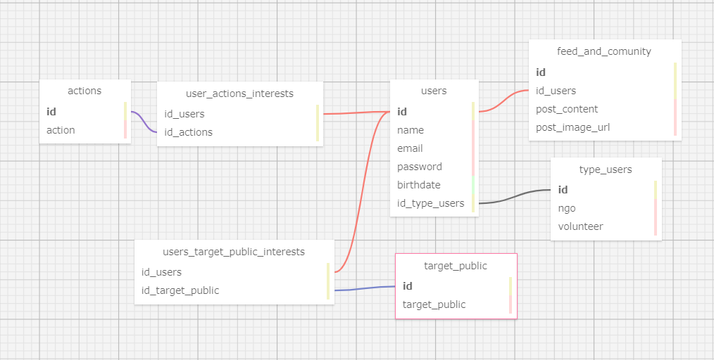

## Documentação Simplificada do Modelo Relacional

*Projeto:* Borbulha
*Data:* 2024-05-09

*Autor:* Mariella Sayumi Mercado Kamezawa

*Objetivo:* O principal objetivo da modelagem de banco de dados é integrar e armazenar os dados de forma a se obter uma visão unificada das informações e a comunicação entre elas, reduzindo erros, facilitando na velocidade e na eficiência da concepção e criação do banco de dados.

## Bano de dados relacional

<div align="center">
<sub> Modelo relacional </sub>

</div>

## Entidades

1. **users (usuários):**
   - Essa tabela armazena informações dos usuários do sistema, como nome, email, senha e outros detalhes relevantes. 

2. **type_users (tipos de usuários):**
   - Define o tipo de usuário cadastrado na plataforma, se é como voluntário ou como organizaçâo não governamental (ONG). 

3. **users_target_public_interests (interesses de público-alvo dos usuários):**
   - Registra os interesses dos usuários em tipos específicos de público-alvo, como crianças em situação de rua, idosos, entre outros.

4. **target_public (público-alvo):**
   -  Essa tabela lista os diferentes tipos de públicos-alvo que podem ser selecionados pelos usuários. 

5. **users_actions_interests (interesses de ações voluntárias dos usuários):**
   - Registra os interesses dos usuários em tipos específicos de ações voluntárias, como abrigos de animais, distribuição de alimentos, entre outros.

6. **actions (ações voluntárias):**
   - Lista os diferentes tipos de ações voluntárias disponíveis na plataforma, como doaçãos, educação, saúde.

7. **feed_and_community (feed e comunidades):**
   -  Essa tabela armazena os dados relacionados às publicações feitas no feed da plataforma e nas comunidades. Isso inclui informações como o texto da postagem, imagem e o usuário.

## Relacionamentos

- Um usuário (users) deve ter um único tipo de usuário na plataforma (type_users) (1:1).

- Um usuário (users) pode ter nenhuma ou várias postagens no feed (feed_and_community) (0:N).

-  Uma postagem no feed (feed_and_community) pertence à apenas um usuário (users) (1:1)

## Regras de Negócio

- Todos os campos obrigatórios devem ser preenchidos.
- As informações devem ser consistentes entre os formulários.
- Os usuários não podem editar informações já salvas, exceto em casos específicos.
- Algumas informações dos usuários são confidenciais.


## Arquivos da modelagem (sql)

```sql
-- ---
-- Globals
-- ---

-- SET SQL_MODE="NO_AUTO_VALUE_ON_ZERO";
-- SET FOREIGN_KEY_CHECKS=0;

-- ---
-- Table 'users'
-- 
-- ---

DROP TABLE IF EXISTS `users`;
		
CREATE TABLE `users` (
  `id` INTEGER NOT NULL AUTO_INCREMENT,
  `name` VARCHAR(50) NOT NULL,
  `email` VARCHAR(50) NULL DEFAULT NULL,
  `password` VARCHAR(12) NULL DEFAULT NULL,
  `birthdate` DATE NULL DEFAULT NULL,
  `id_type_users` INTEGER NULL DEFAULT NULL,
  PRIMARY KEY (`id`)
);

-- ---
-- Table 'users_target_public_interests'
-- 
-- ---

DROP TABLE IF EXISTS `users_target_public_interests`;
		
CREATE TABLE `users_target_public_interests` (
  `id_users` INTEGER NOT NULL,
  `id_target_public` INTEGER NULL DEFAULT NULL,
  PRIMARY KEY ()
);

-- ---
-- Table 'user_actions_interests'
-- 
-- ---

DROP TABLE IF EXISTS `user_actions_interests`;
		
CREATE TABLE `user_actions_interests` (
  `id_users` INTEGER NOT NULL,
  `id_actions` INTEGER NULL DEFAULT NULL,
  PRIMARY KEY ()
);

-- ---
-- Table 'type_users'
-- 
-- ---

DROP TABLE IF EXISTS `type_users`;
		
CREATE TABLE `type_users` (
  `id` INTEGER NULL AUTO_INCREMENT DEFAULT NULL,
  `ngo` BINARY NULL DEFAULT NULL,
  `volunteer` BINARY NULL DEFAULT NULL,
  PRIMARY KEY (`id`)
);

-- ---
-- Table 'feed_and_comunity'
-- 
-- ---

DROP TABLE IF EXISTS `feed_and_comunity`;
		
CREATE TABLE `feed_and_comunity` (
  `id` INTEGER NULL AUTO_INCREMENT DEFAULT NULL,
  `id_users` INTEGER NOT NULL,
  `post_content` VARCHAR(250) NULL DEFAULT NULL,
  `post_image_url` VARCHAR NULL DEFAULT NULL,
  PRIMARY KEY (`id`)
);

-- ---
-- Table 'target_public'
-- 
-- ---

DROP TABLE IF EXISTS `target_public`;
		
CREATE TABLE `target_public` (
  `id` INTEGER NULL AUTO_INCREMENT DEFAULT NULL,
  `target_public` VARCHAR(50) NULL DEFAULT NULL,
  PRIMARY KEY (`id`)
);

-- ---
-- Table 'actions'
-- 
-- ---

DROP TABLE IF EXISTS `actions`;
		
CREATE TABLE `actions` (
  `id` INTEGER NULL AUTO_INCREMENT DEFAULT NULL,
  `action` VARCHAR NULL DEFAULT NULL,
  PRIMARY KEY (`id`)
);

-- ---
-- Foreign Keys 
-- ---

ALTER TABLE `users` ADD FOREIGN KEY (id_type_users) REFERENCES `type_users` (`id`);
ALTER TABLE `users_target_public_interests` ADD FOREIGN KEY (id_users) REFERENCES `users` (`id`);
ALTER TABLE `users_target_public_interests` ADD FOREIGN KEY (id_target_public) REFERENCES `target_public` (`id`);
ALTER TABLE `user_actions_interests` ADD FOREIGN KEY (id_users) REFERENCES `users` (`id`);
ALTER TABLE `user_actions_interests` ADD FOREIGN KEY (id_actions) REFERENCES `actions` (`id`);
ALTER TABLE `feed_and_comunity` ADD FOREIGN KEY (id_users) REFERENCES `users` (`id`);

-- ---
-- Table Properties
-- ---

-- ALTER TABLE `users` ENGINE=InnoDB DEFAULT CHARSET=utf8 COLLATE=utf8_bin;
-- ALTER TABLE `users_target_public_interests` ENGINE=InnoDB DEFAULT CHARSET=utf8 COLLATE=utf8_bin;
-- ALTER TABLE `user_actions_interests` ENGINE=InnoDB DEFAULT CHARSET=utf8 COLLATE=utf8_bin;
-- ALTER TABLE `type_users` ENGINE=InnoDB DEFAULT CHARSET=utf8 COLLATE=utf8_bin;
-- ALTER TABLE `feed_and_comunity` ENGINE=InnoDB DEFAULT CHARSET=utf8 COLLATE=utf8_bin;
-- ALTER TABLE `target_public` ENGINE=InnoDB DEFAULT CHARSET=utf8 COLLATE=utf8_bin;
-- ALTER TABLE `actions` ENGINE=InnoDB DEFAULT CHARSET=utf8 COLLATE=utf8_bin;

-- ---
-- Test Data
-- ---

-- INSERT INTO `users` (`id`,`name`,`email`,`password`,`birthdate`,`id_type_users`) VALUES
-- ('','','','','','');
-- INSERT INTO `users_target_public_interests` (`id_users`,`id_target_public`) VALUES
-- ('','');
-- INSERT INTO `user_actions_interests` (`id_users`,`id_actions`) VALUES
-- ('','');
-- INSERT INTO `type_users` (`id`,`ngo`,`volunteer`) VALUES
-- ('','','');
-- INSERT INTO `feed_and_comunity` (`id`,`id_users`,`post_content`,`post_image_url`) VALUES
-- ('','','','');
-- INSERT INTO `target_public` (`id`,`target_public`) VALUES
-- ('','');
-- INSERT INTO `actions` (`id`,`action`) VALUES
-- ('','');


```


## Arquivos da modelagem (xml)

```xml

<?xml version="1.0" encoding="utf-8" ?>
<!-- SQL XML created by WWW SQL Designer, https://github.com/ondras/wwwsqldesigner/ -->
<!-- Active URL: https://sql.toad.cz/?keyword=online_library -->
<sql>
<datatypes db="mysql">
	<group label="Numeric" color="rgb(238,238,170)">
		<type label="Integer" length="0" sql="INTEGER" quote=""/>
	 	<type label="TINYINT" length="0" sql="TINYINT" quote=""/>
	 	<type label="SMALLINT" length="0" sql="SMALLINT" quote=""/>
	 	<type label="MEDIUMINT" length="0" sql="MEDIUMINT" quote=""/>
	 	<type label="INT" length="0" sql="INT" quote=""/>
		<type label="BIGINT" length="0" sql="BIGINT" quote=""/>
		<type label="Decimal" length="1" sql="DECIMAL" re="DEC" quote=""/>
		<type label="Single precision" length="0" sql="FLOAT" quote=""/>
		<type label="Double precision" length="0" sql="DOUBLE" re="DOUBLE" quote=""/>
	</group>
	<group label="Character" color="rgb(255,200,200)">
		<type label="Char" length="1" sql="CHAR" quote="'"/>
		<type label="Varchar" length="1" sql="VARCHAR" quote="'"/>
		<type label="Text" length="0" sql="MEDIUMTEXT" re="TEXT" quote="'"/>
		<type label="Binary" length="1" sql="BINARY" quote="'"/>
		<type label="Varbinary" length="1" sql="VARBINARY" quote="'"/>
		<type label="BLOB" length="0" sql="BLOB" re="BLOB" quote="'"/>
	</group>
	<group label="Date &amp; Time" color="rgb(200,255,200)">
		<type label="Date" length="0" sql="DATE" quote="'"/>
		<type label="Time" length="0" sql="TIME" quote="'"/>
		<type label="Datetime" length="0" sql="DATETIME" quote="'"/>
		<type label="Year" length="0" sql="YEAR" quote=""/>
		<type label="Timestamp" length="0" sql="TIMESTAMP" quote="'"/>
	</group>
	
	<group label="Miscellaneous" color="rgb(200,200,255)">
		<type label="ENUM" length="1" sql="ENUM" quote=""/>
		<type label="SET" length="1" sql="SET" quote=""/>
		<type label="Bit" length="0" sql="bit" quote=""/>
	</group>
</datatypes></sql>
```


   

## Considerações Finais

&nbsp;&nbsp;&nbsp;&nbsp; O modelo relacional apresentado para o projeto oferece uma estrutura sólida e coerente para o armazenamento e gerenciamento de dados relacionados aos usuários e suas interações na plataforma Borbulha.

&nbsp;&nbsp;&nbsp;&nbsp;Ao definir as entidades, atributos e relacionamentos de forma clara e concisa, este modelo visa promover a integridade e a consistência dos dados, essenciais para o funcionamento eficiente do sistema. É importante ressaltar que este modelo é uma versão inicial e será refinado e expandido conforme o desenvolvimento do projeto avança. 

&nbsp;&nbsp;&nbsp;&nbsp;Em resumo, o modelo relacional proposto para o projeto Borbulha representa um ponto de partida sólido e estruturado para a implementação de um sistema robusto e eficiente, capaz de atender às necessidades dos usuários e alcançar os objetivos estabelecidos para a plataforma.


## Referências

SAP. **O que é modelagem de dados?** Disponível em: [link](https://www.sap.com/brazil/products/technology-platform/datasphere/what-is-data-modeling.html#:~:text=Representa%20o%20processo%20de%20cria%C3%A7%C3%A3o,e%20a%20comunica%C3%A7%C3%A3o%20entre%20elas.). Acesso em: 10 maio 2024. <br>


AMAZON. **Por que a modelagem de dados é importante?** Disponível em: [link](https://aws.amazon.com/pt/what-is/data-modeling/#:~:text=A%20modelagem%20de%20dados%20traz,sistema%20em%20toda%20a%20organiza%C3%A7%C3%A3o). Acesso em: 10 maio 2024. <br>

